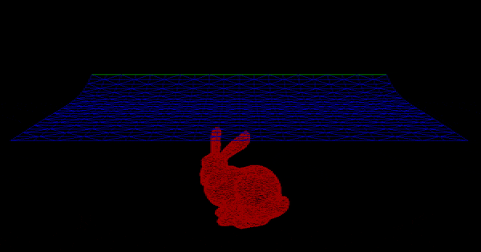

# Position based dynamics 
An implementation of [position based dynamics](http://matthias-mueller-fischer.ch/publications/posBasedDyn.pdf).

Note: Requires Eigen 3.2.4 and assumes it is in /usr/local/Cellar/eigen/3.2.4/include/eigen3/
